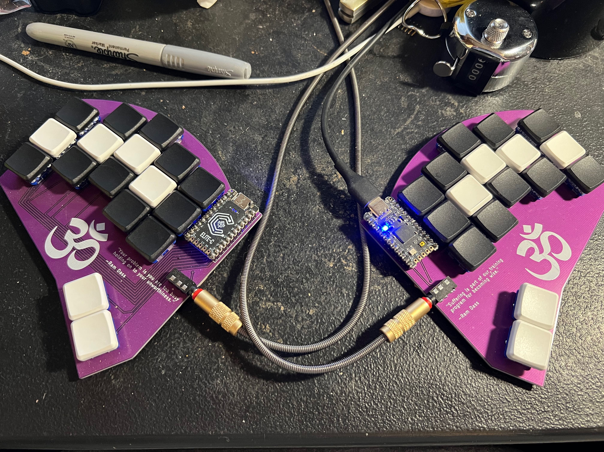
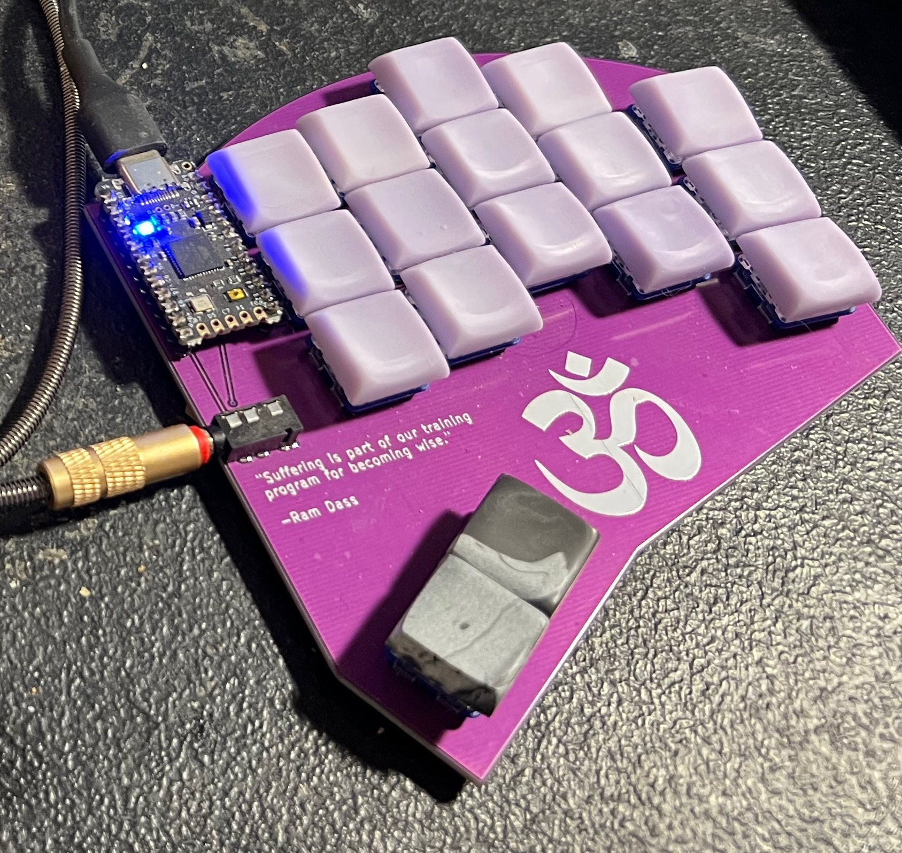

# Om Keyboard

Right now I'm iterating on a 34 key split that uses MX spacing horiontally and choc spacing vertically.  Uses the splay from the Absolem keyboard and the lowered thumb keys of the Draculad.  

PCB's are back from JLC and further iterations will be coming soon.

# Rev 0 Photos

